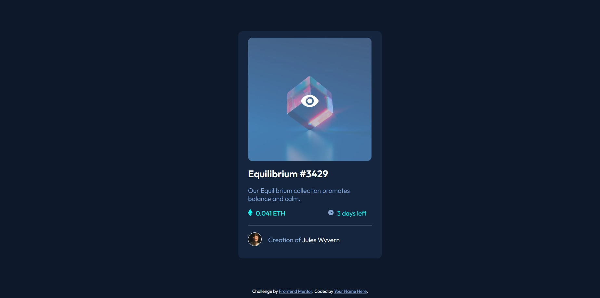
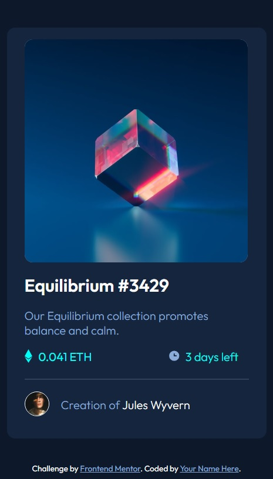

# Frontend Mentor - NFT preview card component

## Table of contents

- [Overview](#overview)
  - [The challenge](#the-challenge)
  - [Screenshot](#screenshot)
  - [Links](#links)
- [My process](#my-process)
  - [Built with](#built-with)
  - [What I learned](#what-i-learned)
  - [Continued development](#continued-development)
  - [Useful resources](#useful-resources)
- [Author](#author)
- [Acknowledgments](#acknowledgments)

## Overview

### The challenge

Users should be able to:

- View the optimal layout depending on their device's screen size
- See hover states for interactive elements

### Screenshot

### Links

- Solution URL: [Add solution URL here](https://github.com/coder-96/frontend-mentor-nft-preview-card-component)
- Live Site URL: [Add live site URL here](https://coder-96.github.io/frontend-mentor-nft-preview-card-component/)

## My process

### Built with

- Semantic HTML5 markup & Non-Semantic HTML5
- CSS custom properties
- Flexbox
- Mobile-first workflow

### What I learned

Improved my raw CSS styling, Flexbox layout skills.

### Continued development

I'm focused on perfecting my skills on Responsive Web Design.

### Useful resources

- [MDN Web Docs](https://developer.mozilla.org/en-US/) - helped me find answers when I got bugs.

## Author

- Website - [Jalga](https://github.com/coder-96)
- Frontend Mentor - [@@coder-96](https://www.frontendmentor.io/profile/coder-96)

## Acknowledgments

I thank my family for supporting me on my way to becoming the best Full Stack Developer I can be. 